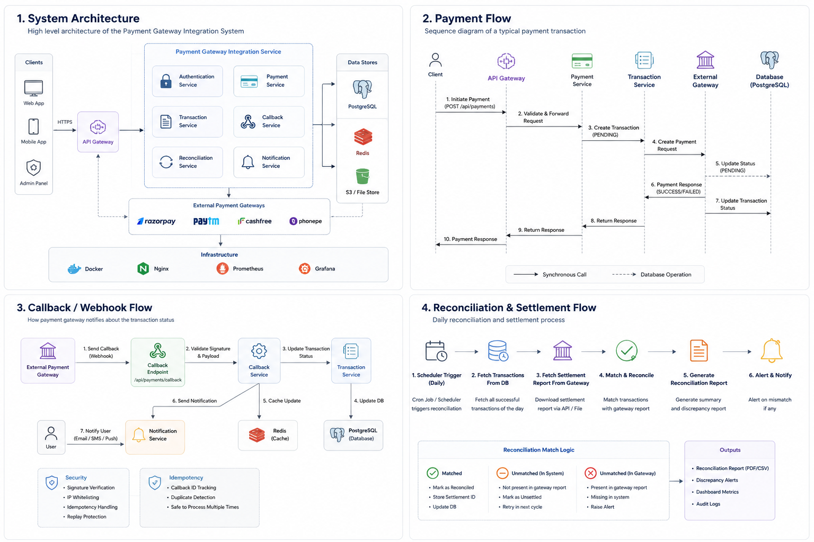

#  Payment Gateway System

Production-oriented payment gateway backend built using Java and Spring Boot with secure transaction processing, gateway routing, reconciliation support, Dockerized deployment, and monitoring-ready architecture.

## Tech Stack

- Java 17
- Spring Boot
- Spring Security
- Spring Data JPA
- PostgreSQL
- Redis
- Docker & Docker Compose
- Maven
- REST APIs
- JWT Authentication

---
## System Architecture



## Features

### Payment Processing
- Payment initiation APIs
- Transaction status tracking
- Callback handling
- Retry and reconciliation support
- Multi-stage transaction lifecycle

### Security
- JWT-based authentication
- AES encryption/decryption utilities
- Environment-based secret management
- Sensitive data masking in logs

### Scalability
- Redis caching support
- Dockerized services
- Centralized configuration structure
- Layered architecture following industry standards

### Monitoring & Reliability
- Structured logging
- Health-check ready setup
- Exception handling
- Audit-friendly transaction flow

---

## Project Structure

```bash
src/main/java
├── controller
├── service
├── repository
├── entity
├── dto
├── security
├── config
├── util
└── exception
```

---

## Getting Started

### Clone Repository

```bash
git clone https://github.com/vishalchourdiya/payment-gateway-integration.git
cd payment-gateway-integration
```

### Configure Environment Variables

Create a `.env` file using:

```bash
cp .env.example .env
```

Update values securely before running the project.

---

## Run With Docker

```bash
docker compose up --build
```

Application will start after PostgreSQL and Redis containers are healthy.

---

## Run Locally

### Build Project

```bash
mvn clean install
```

### Run Application

```bash
mvn spring-boot:run
```

---

## API Documentation

Swagger/OpenAPI support can be accessed after application startup:

```bash
http://localhost:8080/swagger-ui/index.html
```

---

## GitHub Workflow

CI pipeline included using GitHub Actions:
- Maven Build Validation
- Dependency Resolution
- Docker Build Verification

---

## Future Improvements

- Kafka event-driven transaction processing
- Distributed tracing
- Rate limiting
- Circuit breaker integration
- Payment analytics dashboard
- Multi-gateway intelligent routing

---

## Author

### Vishal Chourdiya

Backend Developer focused on:
- Java & Spring Boot
- Payment Systems
- Distributed Systems
- REST APIs
- Scalable Backend Architecture

GitHub:
https://github.com/vishalchourdiya
